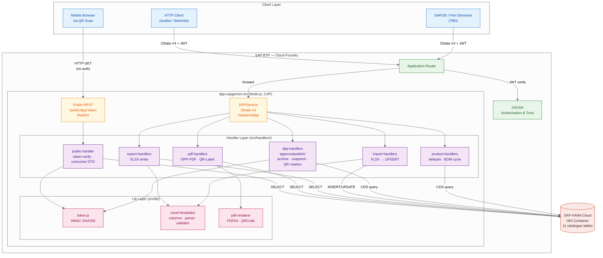
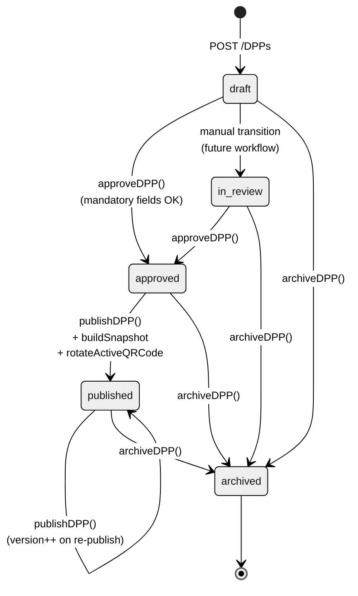
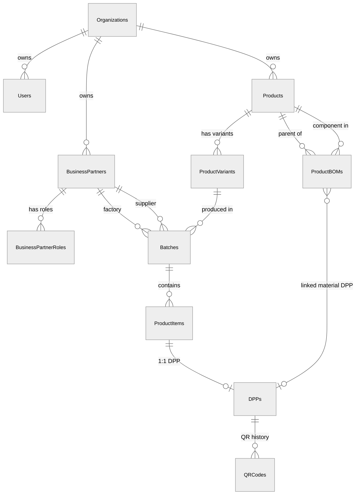

# DPP Capgemini — Architecture Documentation

Versioned alongside the code. Diagram sources live in [docs/diagrams/](diagrams/) and render natively in GitHub, GitLab, and VS Code (`> Markdown: Open Preview`). For PNG/SVG export instructions see [diagrams/README.md](diagrams/README.md).

---

## 1. BTP Architecture

Deployment topology on SAP Business Technology Platform. See [diagrams/btp-architecture.drawio](diagrams/btp-architecture.drawio) for the editable diagram (open in [diagrams.net](https://app.diagrams.net) or VS Code with the *Draw.io Integration* extension).

### BTP services in use

| Service | Role | Status |
|---|---|---|
| **SAP HANA Cloud** | Persistent store for all 11 entities via HDI container | ✅ via `@cap-js/hana` |
| **Cloud Foundry Runtime** | Hosts the `dpp-capgemini-srv` Node.js app | ✅ deployable via `mta.yaml` |
| **XSUAA** | OAuth2/JWT issuer; tenant isolation via `attr.tenant` | ✅ via `xs-security.json` |
| **Application Router** | XSUAA token termination + static UI serving | ✅ enabled in production profile |
| Destination Service | ERP / S/4HANA integration | ⛔ Out-of-Scope MVP |
| Document Management Service | Compliance document storage | ⛔ Sprint 2+ |
| Alert Notification, App Logging | Ops monitoring | ⛔ Sprint 2+ |

### Topology

```
Consumer / UI / Auditor
        │
        ▼
┌────────────────────────────────────────────────┐
│  SAP BTP — Cloud Foundry Runtime                │
│                                                  │
│   Approuter ──verify JWT── XSUAA                │
│        │                                          │
│        ▼                                          │
│   dpp-capgemini-srv  (Node.js · CAP)             │
│    • OData V4  /odata/v4/dpp                     │
│    • Public REST /public/dpp/:token              │
│    • Handlers · Libs                              │
│        │                                          │
│        ▼ HDI                                      │
│   SAP HANA Cloud  ─ 11 tables                    │
└────────────────────────────────────────────────┘
```

---

## 2. Software Architecture



Source: [diagrams/software-architecture.mmd](diagrams/software-architecture.mmd)

### OData / REST endpoint inventory

| Path | Verb | Function | Auth |
|---|---|---|---|
| `/odata/v4/dpp` | GET/POST/PATCH/DELETE | 11 entity projections | XSUAA scope |
| `/odata/v4/dpp/DPPs(id)/DPPService.approveDPP` | POST | draft → approved | admin/advanced |
| `/odata/v4/dpp/DPPs(id)/DPPService.publishDPP` | POST | approved → published + Snapshot + QR | admin/advanced |
| `/odata/v4/dpp/DPPs(id)/DPPService.archiveDPP` | POST | → archived | admin/advanced |
| `/odata/v4/dpp/DPPs(id)/DPPService.regenerateQRToken` | POST | new HMAC token | admin/advanced |
| `/odata/v4/dpp/DPPs(id)/DPPService.generateQRCode` | GET | Base64-PNG inline | all roles |
| `/odata/v4/dpp/DPPs(id)/DPPService.exportDPPasPDF` | GET | PDF | all roles |
| `/odata/v4/dpp/DPPs(id)/DPPService.generateQRLabel` | GET | printable label PDF | all roles |
| `/odata/v4/dpp/importProducts` | POST | Excel UPSERT | admin/advanced |
| `/odata/v4/dpp/importBatches` | POST | Excel UPSERT | admin/advanced |
| `/odata/v4/dpp/importBOM` | POST | Excel UPSERT | admin/advanced |
| `/odata/v4/dpp/downloadTemplate(template=...)` | GET | XLSX template | all roles |
| `/odata/v4/dpp/exportProducts()` | GET | XLSX export | all roles |
| `/odata/v4/dpp/exportBOM()` | GET | XLSX export | all roles |
| `/odata/v4/dpp/exportDPP(dppId=...)` | GET | single DPP XLSX | all roles |
| `/odata/v4/dpp/exportDPPs(dppIds=...)` | GET | bulk DPP XLSX | all roles |
| `/odata/v4/dpp/exportTraceability()` | GET | multi-sheet XLSX | all roles |
| `/public/dpp/:token` | GET | consumer DTO (JSON) | none |
| `/public/dpp/:token/qr.png` | GET | QR PNG | none |
| `/healthz` | GET | health check | none |

### DPP lifecycle



Source: [diagrams/dpp-lifecycle.mmd](diagrams/dpp-lifecycle.mmd)

### Sprint-1 demo flow

The end-to-end happy-path sequence used as the MVP acceptance test (see [Epics and user stories.pdf](../../Epics%20and%20user%20stories.pdf), Sprint-1 demo scenario):

Source: [diagrams/sprint1-demo-sequence.mmd](diagrams/sprint1-demo-sequence.mmd)

---

## 3. Semantic Model (Entity-Relationship)



Full attribute-level ERD in [diagrams/erd.mmd](diagrams/erd.mmd).

Cardinalities — cross-referenced with the official Field Catalogue (`Fashion_DPP_Object_Field_Catalogue.xlsm`, Sheet 5):

| Relation | Cardinality | Catalogue Ref |
|---|---|---|
| Organizations → Users | 1:N | R2 |
| Organizations → Products | 1:N | R3 |
| BusinessPartners → BusinessPartnerRoles | 1:N | R4 |
| Products → ProductVariants | 1:N | R5 |
| ProductVariants → Batches | 1:N | R6 |
| Batches → ProductItems | 1:N | R7 |
| ProductItems → DPPs | 1:1 | R8 |
| DPPs → QRCodes | 1:N (1 active + history) | R9 |
| Products → ProductBOMs (as parent) | 1:N | R10 |
| ProductBOMs → Products (as component) | N:1 | R11 |
| ProductBOMs → DPPs (linked material) | N:0..1 | R12 |

---

## 4. Technical Model — Table Schema

> The implementation uses **SAP CAP / CDS**, not ABAP DDIC. Tables compile to **SAP HANA Cloud** (prod) or **SQLite** (dev). Each column below is given with its CDS type, deployed HANA SQL type, and an ABAP DDIC equivalent for documentation templates that require it.

### 4.1 ORG layer

#### `DPP_ORGANIZATIONS`
| Column | CDS Type | HANA Type | Constraints |
|---|---|---|---|
| ID | String(36) | NVARCHAR(36) | PK |
| legal_name | String(120) | NVARCHAR(120) | NOT NULL |
| trade_name | String(120) | NVARCHAR(120) | |
| country_iso2 | String(2) | NVARCHAR(2) | |
| city | String(80) | NVARCHAR(80) | |
| gln | String(13) | NVARCHAR(13) | |
| website_url | String(500) | NVARCHAR(500) | |
| contact_email | String(254) | NVARCHAR(254) | |
| tenant_id | String(64) | NVARCHAR(64) | NOT NULL, UNIQUE |
| is_platform_tenant | Boolean | BOOLEAN | DEFAULT FALSE |

#### `DPP_USERS`
| Column | CDS Type | HANA Type | Constraints |
|---|---|---|---|
| ID | String(36) | NVARCHAR(36) | PK |
| email | String(254) | NVARCHAR(254) | NOT NULL; UNIQUE per organization |
| display_name | String(120) | NVARCHAR(120) | |
| organization_ID | String(36) | NVARCHAR(36) | NOT NULL, FK → ORGANIZATIONS |
| role | String(12) | NVARCHAR(12) | NOT NULL — enum admin/advanced/user/viewer |
| external_user_id | String(120) | NVARCHAR(120) | IdP mapping |
| active | Boolean | BOOLEAN | DEFAULT TRUE |

#### `DPP_BUSINESS_PARTNERS`
| Column | CDS Type | HANA Type | Constraints |
|---|---|---|---|
| ID | String(36) | NVARCHAR(36) | PK |
| owning_organization_ID | String(36) | NVARCHAR(36) | NOT NULL, FK |
| name | String(120) | NVARCHAR(120) | NOT NULL |
| country_iso2 | String(2) | NVARCHAR(2) | |
| city | String(80) | NVARCHAR(80) | |
| address | String(200) | NVARCHAR(200) | |
| contact_person | String(120) | NVARCHAR(120) | |
| contact_email | String(254) | NVARCHAR(254) | |
| identifier | String(40) | NVARCHAR(40) | GLN/VAT/DUNS |
| archived | Boolean | BOOLEAN | DEFAULT FALSE |

#### `DPP_BUSINESS_PARTNER_ROLES`
| Column | CDS Type | HANA Type | Constraints |
|---|---|---|---|
| ID | String(36) | NVARCHAR(36) | PK |
| partner_ID | String(36) | NVARCHAR(36) | NOT NULL, FK |
| role | String(24) | NVARCHAR(24) | NOT NULL — enum |

Constraint: `UNIQUE (partner_ID, role)`.

### 4.2 PRODUCT layer

#### `DPP_PRODUCTS`
| Column | CDS Type | HANA Type | Constraints |
|---|---|---|---|
| ID | String(36) | NVARCHAR(36) | PK |
| owning_organization_ID | String(36) | NVARCHAR(36) | NOT NULL, FK |
| product_type | String(12) | NVARCHAR(12) | NOT NULL DEFAULT 'finished' — enum |
| name | String(120) | NVARCHAR(120) | NOT NULL |
| brand | String(120) | NVARCHAR(120) | |
| category | String(60) | NVARCHAR(60) | |
| model | String(120) | NVARCHAR(120) | |
| description | String(500) | NVARCHAR(500) | |
| gtin | String(14) | NVARCHAR(14) | UNIQUE per org |
| fibre_composition | String(500) | NVARCHAR(500) | |
| care_instructions | String(500) | NVARCHAR(500) | |
| repair_instructions | String(500) | NVARCHAR(500) | |
| disposal_instructions | String(500) | NVARCHAR(500) | |
| country_of_origin | String(2) | NVARCHAR(2) | ISO-2 |
| substances_of_concern | String(500) | NVARCHAR(500) | REACH/SCIP text |
| espr_compliance | String(16) | NVARCHAR(16) | enum |
| status | String(12) | NVARCHAR(12) | DEFAULT 'draft' — enum |

#### `DPP_PRODUCT_VARIANTS`
| Column | CDS Type | HANA Type | Constraints |
|---|---|---|---|
| ID | String(36) | NVARCHAR(36) | PK |
| product_ID | String(36) | NVARCHAR(36) | NOT NULL, FK |
| color | String(40) | NVARCHAR(40) | |
| size | String(20) | NVARCHAR(20) | |
| sku | String(40) | NVARCHAR(40) | UNIQUE per product |
| gtin | String(14) | NVARCHAR(14) | |
| weight_g | Integer | INTEGER | |
| status | String(10) | NVARCHAR(10) | DEFAULT 'active' — enum |

#### `DPP_BATCHES`
| Column | CDS Type | HANA Type | Constraints |
|---|---|---|---|
| ID | String(36) | NVARCHAR(36) | PK |
| variant_ID | String(36) | NVARCHAR(36) | NOT NULL, FK |
| batch_number | String(40) | NVARCHAR(40) | UNIQUE per variant |
| production_date | Date | DATE | |
| factory_ID | String(36) | NVARCHAR(36) | FK → BusinessPartners |
| supplier_ID | String(36) | NVARCHAR(36) | FK → BusinessPartners |
| country_of_origin | String(2) | NVARCHAR(2) | |
| production_stage | String(60) | NVARCHAR(60) | |
| co2_footprint_kg | Decimal(10,3) | DECIMAL(10,3) | |
| recycled_content_pct | Decimal(5,2) | DECIMAL(5,2) | |
| status | String(12) | NVARCHAR(12) | DEFAULT 'draft' — enum |

#### `DPP_PRODUCT_ITEMS`
| Column | CDS Type | HANA Type | Constraints |
|---|---|---|---|
| ID | String(36) | NVARCHAR(36) | PK |
| batch_ID | String(36) | NVARCHAR(36) | NOT NULL, FK |
| serial_number | String(40) | NVARCHAR(40) | UNIQUE per batch |
| upi | String(60) | NVARCHAR(60) | UNIQUE global |
| item_status | String(12) | NVARCHAR(12) | DEFAULT 'active' — enum |
| created_date | Date | DATE | |
| dpp_ID | String(36) | NVARCHAR(36) | FK → DPPs |

#### `DPP_PRODUCT_BOMS`
| Column | CDS Type | HANA Type | Constraints |
|---|---|---|---|
| ID | String(36) | NVARCHAR(36) | PK |
| parent_ID | String(36) | NVARCHAR(36) | NOT NULL, FK → Products |
| component_ID | String(36) | NVARCHAR(36) | NOT NULL, FK → Products |
| quantity | Decimal(10,3) | DECIMAL(10,3) | |
| unit | String(8) | NVARCHAR(8) | % / kg / m / pcs |
| component_role | String(60) | NVARCHAR(60) | |
| is_mandatory | Boolean | BOOLEAN | DEFAULT TRUE |
| linked_dpp_ID | String(36) | NVARCHAR(36) | FK → DPPs |
| status | String(12) | NVARCHAR(12) | DEFAULT 'active' — enum |

Constraint: `UNIQUE (parent_ID, component_ID)` — prevents duplicate BOM edges.

### 4.3 DPP layer

#### `DPP_DPPS`
| Column | CDS Type | HANA Type | Constraints |
|---|---|---|---|
| ID | String(36) | NVARCHAR(36) | PK |
| product_ID | String(36) | NVARCHAR(36) | NOT NULL, FK |
| item_ID | String(36) | NVARCHAR(36) | FK |
| granularity | String(8) | NVARCHAR(8) | DEFAULT 'item' — enum |
| dpp_type | String(12) | NVARCHAR(12) | DEFAULT 'product' — enum |
| status | String(12) | NVARCHAR(12) | DEFAULT 'draft' — enum |
| visibility | String(8) | NVARCHAR(8) | DEFAULT 'internal' — enum |
| current_version | Integer | INTEGER | DEFAULT 1 |
| qr_token | String(128) | NVARCHAR(128) | UNIQUE — HMAC-signed |
| qr_payload_url | String(500) | NVARCHAR(500) | |
| public_url | String(500) | NVARCHAR(500) | |
| approved_at | Timestamp | TIMESTAMP | |
| published_at | Timestamp | TIMESTAMP | |
| archived_at | Timestamp | TIMESTAMP | |
| valid_from | Date | DATE | |
| last_updated | Timestamp | TIMESTAMP | |
| aggregated_snapshot | LargeString | NCLOB | JSON snapshot |
| storytelling | LargeString | NCLOB | JSON array |

#### `DPP_QR_CODES`
| Column | CDS Type | HANA Type | Constraints |
|---|---|---|---|
| ID | String(36) | NVARCHAR(36) | PK |
| dpp_ID | String(36) | NVARCHAR(36) | NOT NULL, FK |
| qr_value | String(500) | NVARCHAR(500) | Encoded URL |
| qr_image_url | String(500) | NVARCHAR(500) | |
| status | String(10) | NVARCHAR(10) | DEFAULT 'active' — enum |
| created_at | Timestamp | TIMESTAMP | |
| replaced_at | Timestamp | TIMESTAMP | |

### 4.4 CDS → HANA SQL → ABAP DDIC mapping

For documentation templates that require ABAP-DDIC equivalents:

| CDS | HANA SQL | ABAP DDIC | Notes |
|---|---|---|---|
| `String(n)` | `NVARCHAR(n)` | `CHAR(n)` / `SSTRING` | UTF-16 in HANA |
| `LargeString` | `NCLOB` | `STRING` | up to 2 GB |
| `Boolean` | `BOOLEAN` | `BOOLE_D` / `ABAP_BOOL` | |
| `Integer` | `INTEGER` | `INT4` | 32-bit signed |
| `Integer64` | `BIGINT` | `INT8` | 64-bit signed |
| `Decimal(p,s)` | `DECIMAL(p,s)` | `DEC(p,s)` | |
| `Date` | `DATE` | `DATS` | YYYYMMDD |
| `Time` | `TIME` | `TIMS` | HHMMSS |
| `Timestamp` | `TIMESTAMP` | `TIMESTAMPL` | 100 ns precision |
| `UUID` | `NVARCHAR(36)` | `SYSUUID_C32` / `SYSUUID_X16` | |

---

## References

- Catalogue: [Fashion_DPP_Object_Field_Catalogue.xlsm](../../Fashion_DPP_Object_Field_Catalogue.xlsm)
- Requirements: [SS26_Capgemini_requirements_presentation.docx.pdf](../../SS26_Capgemini_requirements_presentation.docx.pdf)
- User Stories: [Epics and user stories.pdf](../../Epics%20and%20user%20stories.pdf)
- BTP Solution Diagrams icon set: <https://sap.github.io/btp-solution-diagrams/>
