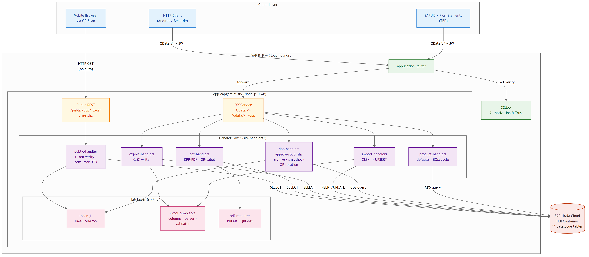
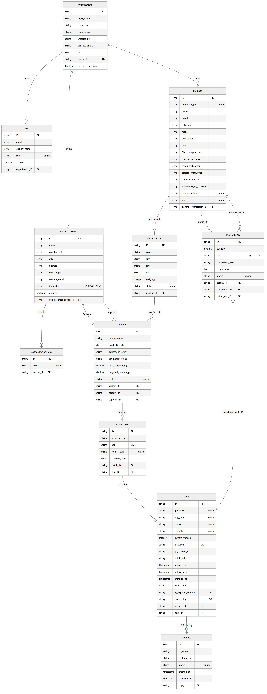
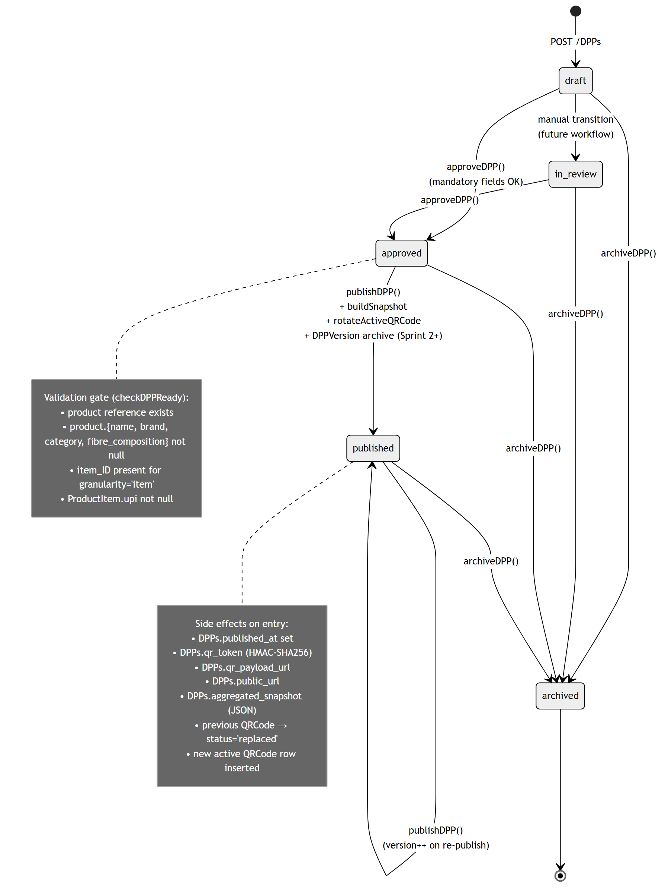
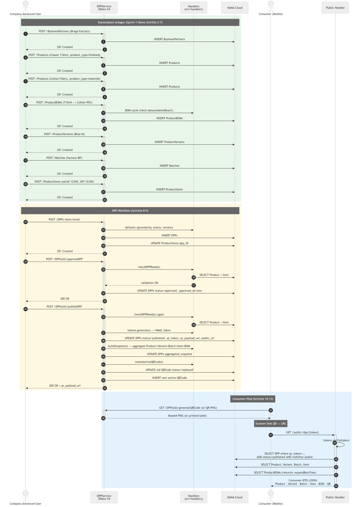

% DPP Capgemini — Technical Documentation
% Digital Product Passport Backend (Fashion)
% 2026

# Overview

The **dpp_capgemini** project is a backend for an EU-ESPR–oriented Digital Product Passport (DPP) targeted at the fashion industry. It is implemented as a TUM × Capgemini student project.

The schema is strictly aligned with the **Fashion DPP Object Field Catalogue** (`Fashion_DPP_Object_Field_Catalogue.xlsm`) — 11 MVP entities, no extras. Sprint 2+ catalogue objects (Compliance Record, Sustainability Metric, Visibility Rule, Document Link, Certificate as N:N) are intentionally deferred.

**Technology stack**

- SAP Cloud Application Programming Model (CAP), Node.js, `@sap/cds` ^9
- CDS data model, OData V4 services, auto-generated OpenAPI / Swagger
- SQLite (development) / SAP HANA Cloud (production on SAP BTP)
- XSUAA authentication with four roles: `admin`, `advanced`, `user`, `viewer`
- Public consumer endpoint (`/public/dpp/:token`, no login) with HMAC-signed QR-code PNG
- Excel import/export (XLSX) and PDF export (DPP + QR label) via PDFKit
- Jest unit tests + `cds.test` integration tests

# 1. Technical Data Model (Data Schema)

The data model is declared in CDS (SAP Cloud Application Programming Model) and lives under `db/`. It is split into four files:

- `db/common.cds` — base types and enumerations
- `db/org.cds` — Company, Users, Business Partners
- `db/product.cds` — Products, Variants, Batches, Items, BOM
- `db/dpp.cds` — Digital Product Passport and QR Codes

## 1.1 Types and Enumerations (`common.cds`)

| Type | Definition | Purpose |
|------|------------|---------|
| `CountryISO2` | `String(2)` | ISO-3166-1 alpha-2 country code |
| `GTIN` | `String(14)` | Global Trade Item Number |
| `GLN` | `String(13)` | Global Location Number |
| `EmailAddr` | `String(254)` | RFC 5321-compliant e-mail |
| `URL` | `String(500)` | External references, QR payload |
| `ProductType` | enum | finished, material, component, packaging |
| `ProductStatus` | enum | draft, approved, published, archived |
| `VariantStatus` | enum | active, inactive, archived |
| `BatchStatus` | enum | draft, approved, archived |
| `BOMStatus` | enum | active, archived |
| `ItemStatus` | enum | active, sold, repaired, recycled, disposed, archived |
| `DPPStatus` | enum | draft, in_review, approved, published, archived |
| `DPPType` | enum | product, material |
| `Visibility` | enum | internal, public |
| `Granularity` | enum | model, batch, item |
| `QRCodeStatus` | enum | active, invalid, replaced |
| `ESPRComplianceStatus` | enum | draft, in_review, compliant, non_compliant |
| `UserRole` | enum | admin, advanced, user, viewer |
| `BusinessPartnerRole` | enum | supplier, manufacturer, recycler, certification_body, distributor, retailer, logistics_provider |

The `identified` aspect provides a readable `String(36)` key instead of a UUID. This is a deliberate choice so that sample IDs such as `dpp-12345` and upstream system identifiers can be kept unchanged.

## 1.2 Company, User and Business Partner Entities (`org.cds`)

### Organizations (Company)

The tenant is represented by the `tenant_id` column (UNIQUE). Mapped to the catalogue's "Company" object.

| Field | Type | Constraint |
|-------|------|------------|
| ID | String(36) | Primary key |
| legal_name | String(120) | not null |
| trade_name | String(120) | |
| country_iso2 | CountryISO2 | |
| city | String(80) | |
| gln | GLN | |
| website_url | URL | |
| contact_email | EmailAddr | |
| tenant_id | String(64) | not null, UNIQUE |
| is_platform_tenant | Boolean | default false |

### Users

n:1 to Organizations; UNIQUE constraint on `(email, organization)`; `external_user_id` links to the XSUAA subject.

| Field | Type | Notes |
|-------|------|-------|
| ID | String(36) | Primary key |
| email | EmailAddr | not null |
| display_name | String(120) | |
| organization | Association to Organizations | not null |
| role | UserRole | not null |
| external_user_id | String(120) | XSUAA subject mapping |
| active | Boolean | default true (US1.10 Deactivate User) |

### BusinessPartners

External economic operators (factories, suppliers, certification bodies). Tenant-scoped via `owning_organization`.

| Field | Type | Notes |
|-------|------|-------|
| ID | String(36) | Primary key |
| owning_organization | Association to Organizations | not null |
| name | String(120) | not null |
| country_iso2 | CountryISO2 | |
| city | String(80) | |
| address | String(200) | |
| contact_person | String(120) | |
| contact_email | EmailAddr | |
| identifier | String(40) | GLN / VAT / DUNS |
| archived | Boolean | default false |
| roles | Composition of BusinessPartnerRoles | a partner can hold multiple roles |

### BusinessPartnerRoles

Bridge table — one partner may simultaneously act as supplier, manufacturer, recycler, etc. (US2.3).

| Field | Type | Notes |
|-------|------|-------|
| ID | String(36) | Primary key |
| partner | Association to BusinessPartners | not null |
| role | BusinessPartnerRole | not null |

UNIQUE on `(partner, role)`.

## 1.3 Product Hierarchy (`product.cds`)

The catalogue-aligned hierarchy is **Product → ProductVariant → Batch → ProductItem → DPP + QR**. BOM lines link a parent product to a component product (back to the same `Products` entity), so the chain repeats recursively for materials/components.

### Products

Generic product master data: a finished product, material, component or packaging. Tenant-scoped via `owning_organization`.

| Field | Type | Notes |
|-------|------|-------|
| ID | String(36) | Primary key |
| owning_organization | Association to Organizations | not null |
| product_type | ProductType | not null, default `finished` |
| name | String(120) | not null |
| brand | String(120) | |
| category | String(60) | |
| model | String(120) | |
| description | String(500) | |
| gtin | GTIN | UNIQUE per organization |
| fibre_composition | String(500) | catalogue Sheet 3 R32 |
| care_instructions | String(500) | |
| repair_instructions | String(500) | |
| disposal_instructions | String(500) | |
| country_of_origin | CountryISO2 | high-level origin |
| substances_of_concern | String(500) | REACH / SCIP text (Sheet 3 R37) |
| espr_compliance | ESPRComplianceStatus | default `draft` |
| status | ProductStatus | default `draft` |

### ProductVariants

n:1 to Products. A variant captures color/size/SKU and identification at variant level.

| Field | Type | Notes |
|-------|------|-------|
| ID | String(36) | Primary key |
| product | Association to Products | not null |
| color | String(40) | |
| size | String(20) | |
| sku | String(40) | UNIQUE per product |
| gtin | GTIN | |
| weight_g | Integer | |
| status | VariantStatus | default `active` |

### Batches

n:1 to ProductVariants. Captures production-time information (factory, country, CO₂).

| Field | Type | Notes |
|-------|------|-------|
| ID | String(36) | Primary key |
| variant | Association to ProductVariants | not null |
| batch_number | String(40) | UNIQUE per variant |
| production_date | Date | |
| factory | Association to BusinessPartners | optional |
| supplier | Association to BusinessPartners | optional |
| country_of_origin | CountryISO2 | |
| production_stage | String(60) | |
| co2_footprint_kg | Decimal(10,3) | |
| recycled_content_pct | Decimal(5,2) | |
| status | BatchStatus | default `draft` |

### ProductItems

The serialised, uniquely identifiable physical item. Each item gets its own DPP.

| Field | Type | Notes |
|-------|------|-------|
| ID | String(36) | Primary key |
| batch | Association to Batches | not null |
| serial_number | String(40) | UNIQUE per batch |
| upi | String(60) | UNIQUE global — Unique Product Identity (catalogue R61) |
| item_status | ItemStatus | default `active` |
| created_date | Date | |
| dpp | Association to DPPs | linked after `publishDPP` |

### ProductBOMs

Bill of Materials: an edge between a parent Product and a component Product. The component is **also a `Products` row**, so it can carry its own variants/batches/items/DPPs.

| Field | Type | Notes |
|-------|------|-------|
| ID | String(36) | Primary key |
| parent | Association to Products | not null — finished/parent product |
| component | Association to Products | not null — material/component |
| quantity | Decimal(10,3) | |
| unit | String(8) | `%`, `kg`, `m`, `pcs` |
| component_role | String(60) | e.g. "Main fabric" |
| is_mandatory | Boolean | default true |
| linked_dpp | Association to DPPs | optional link to a material DPP (US4.9) |
| status | BOMStatus | default `active` |

UNIQUE on `(parent, component)`. Self-loops and transitive cycles are rejected by handler.

## 1.4 Digital Product Passport (`dpp.cds`)

### DPPs

The central passport entity. Item-level by default but supports model- and batch-granularity for non-serialised products.

| Field | Type | Meaning |
|-------|------|---------|
| ID | String(36) | Primary key |
| product | Association to Products | not null — always anchored on the model |
| item | Association to ProductItems | optional — required for item-level DPPs |
| granularity | Granularity | default `item` |
| dpp_type | DPPType | default `product` |
| status | DPPStatus | default `draft` |
| visibility | Visibility | default `internal` |
| current_version | Integer | default 1, incremented on re-publish |
| qr_token | String(128) | UNIQUE, HMAC-signed |
| qr_payload_url | URL | encoded into the QR PNG |
| public_url | URL | stable direct link to the DPP page |
| approved_at, published_at, archived_at | Timestamp | lifecycle markers |
| valid_from | Date | |
| last_updated | Timestamp | |
| aggregated_snapshot | LargeString | JSON snapshot built on `publishDPP` |
| storytelling | LargeString | optional JSON array of `{title, body, media_url, media_type}` |

### QRCodes

History of every QR token ever minted for a DPP. The most recent row has `status='active'`; previous rows are kept with `status='replaced'` for traceability (US6.8).

| Field | Type | Notes |
|-------|------|-------|
| ID | String(36) | Primary key |
| dpp | Association to DPPs | not null |
| qr_value | URL | encoded URL on the physical label |
| qr_image_url | URL | optional pointer to a rendered PNG |
| status | QRCodeStatus | `active`, `invalid`, `replaced` |
| created_at | Timestamp | |
| replaced_at | Timestamp | |

## 1.5 Uniqueness and Integrity Constraints

- `Organizations.tenant_id` UNIQUE
- `Users (email, organization)` UNIQUE
- `BusinessPartnerRoles (partner, role)` UNIQUE
- `Products (gtin, owning_organization)` UNIQUE
- `ProductVariants (sku, product)` UNIQUE
- `Batches (batch_number, variant)` UNIQUE
- `ProductItems.upi` UNIQUE (global)
- `ProductItems (serial_number, batch)` UNIQUE
- `ProductBOMs (parent, component)` UNIQUE — no duplicate BOM edges, no self-loops, no cycles
- `DPPs.qr_token` UNIQUE

# 2. Architecture Diagrams

## 2.1 Software Architecture

Three client classes (internal company users, public auditor/HTTP-clients, and anonymous consumers) connect to a CAP runtime hosted on SAP BTP Cloud Foundry. Authenticated traffic flows through the Application Router and XSUAA; the public consumer route bypasses authentication and is mounted directly on the Express bootstrap. Persistence targets SQLite for local development and SAP HANA Cloud in production.



**Component responsibilities.**

- **Application Router** — terminates user sessions and forwards JWTs to CAP services (production).
- **XSUAA** — issues OAuth2 JWTs and exposes role-template-driven scopes (`admin`, `advanced`, `user`, `viewer`).
- **DPPService** — tenant-scoped CRUD for the 11 catalogue entities, plus DPP-lifecycle actions and Excel/PDF actions.
- **Public Handler** — anonymous consumer route serving a visibility-filtered Consumer DTO and the QR PNG.
- **Handler modules** — `product-handlers` (defaults, BOM cycle guard), `dpp-handlers` (workflow + snapshot + QR rotation), `import-handlers` (XLSX → UPSERT), `export-handlers` (XLSX writer), `pdf-handlers` (DPP-PDF + QR-Label), `public-handler`.
- **Lib modules** — `token.js` (HMAC-SHA256), `excel-templates.js` (column metadata + parser/validator), `pdf-renderer.js` (PDFKit + qrcode).
- **Persistence** — SQLite locally, SAP HANA Cloud in production; the CDS model is portable across both.

## 2.2 ER Diagram (Data Model)

Organizations sit at the top of the master-data tree; they own Users, BusinessPartners, and Products. A Product fans out through ProductVariants → Batches → ProductItems, and each ProductItem owns a 1:1 DPP. The DPP keeps a history of QRCodes (latest = active). ProductBOMs link a parent Product to a component Product (back to the same entity), so the entire chain repeats recursively for materials and components.



**Key entity attributes (compact view).**

- **Organizations** — `ID` (PK), `tenant_id` (UNIQUE), `legal_name`, `country_iso2`, `website_url`, `contact_email`.
- **Products** — `ID` (PK), `product_type`, `name`, `brand`, `category`, `country_of_origin`, `substances_of_concern`, `espr_compliance`, `status`, `owning_organization` (FK).
- **ProductVariants** — `ID` (PK), `product` (FK), `color`, `size`, `sku` (UNIQUE per product), `gtin`, `status`.
- **Batches** — `ID` (PK), `variant` (FK), `batch_number` (UNIQUE per variant), `production_date`, `factory`/`supplier` (FK), `country_of_origin`, `co2_footprint_kg`, `recycled_content_pct`, `status`.
- **ProductItems** — `ID` (PK), `batch` (FK), `serial_number`, `upi` (UNIQUE), `item_status`, `dpp` (FK).
- **ProductBOMs** — `parent` (FK), `component` (FK), `quantity`, `unit`, `component_role`, `linked_dpp` (FK); UNIQUE on the edge, no cycles allowed.
- **DPPs** — `ID` (PK), `product` (FK), `item` (FK), `status`, `visibility`, `current_version`, `qr_token` (UNIQUE), `public_url`, `aggregated_snapshot` (JSON), `published_at`, `archived_at`.
- **QRCodes** — `dpp` (FK), `qr_value`, `status` (`active`/`invalid`/`replaced`), `created_at`, `replaced_at`.

## 2.3 DPP Lifecycle (State Machine)

DPP status moves from `draft` (or optionally `in_review`) to `approved`, then `published`. Re-publishing increments `current_version`. Any state can be moved to `archived`. The catalogue mandates these five status values (Sheet 3 R79).



The `approveDPP` and `publishDPP` actions both invoke the inline validator `checkDPPReady`, which rejects with HTTP 400 if mandatory product or item fields are missing. On `publishDPP`, the handler additionally builds an aggregated JSON snapshot, stores it in `DPPs.aggregated_snapshot`, rotates the active QR (`status='active'` → `'replaced'` for the previous one, new active row inserted), and updates `DPPs.qr_token` / `qr_payload_url` / `public_url`.

## 2.4 Sprint-1 Demo Workflow

The end-to-end happy-path sequence used as the MVP acceptance test (Epics document, Sprint-1 demo scenario). A company advanced user creates the supply-chain stack from Business Partner down to Item, then approves and publishes the DPP. The published QR code resolves anonymously to the Consumer DTO.



**Token format.**

```
<uuid-v4>.<base64url(HMAC-SHA256(QR_TOKEN_HMAC_SECRET, uuid))>
```

The HMAC prefix lets the public route reject forged tokens in constant time (`timingSafeEqual`) before any database lookup. Sensitive fields (tenant, audit columns, internal counters) are intentionally excluded from the Consumer DTO.

## 2.5 BTP Deployment Architecture

The deployment topology onto SAP BTP Cloud Foundry is maintained as a separate editable diagram in [diagrams/btp-architecture.drawio](diagrams/btp-architecture.drawio). It can be opened in [diagrams.net](https://app.diagrams.net) or VS Code with the *Draw.io Integration* extension. See [diagrams/README.md](diagrams/README.md) for the swap-to-official-SAP-BTP-icons workflow.

## 2.6 Role / Capability Matrix

Authorization is layered. The service annotation `@requires` controls who can reach the service at all; per-entity `@restrict` rules then combine the caller's role with a `where` clause that pins each query to `Organizations.tenant_id = $user.tenant`.

| Capability | admin | advanced | user | viewer | public (no auth) |
|------------|-------|----------|------|--------|------------------|
| Read tenant DPPs / Products / Batches / Items | yes | yes | yes | yes | — |
| Create / update / delete master data | yes | yes | — | — | — |
| Create / update ProductItems and DPPs | yes | yes | yes | — | — |
| Approve / publish / archive DPP | yes | yes | — | — | — |
| Manage Users | yes | — | — | — | — |
| Excel import (Products / Batches / BOM) | yes | yes | — | — | — |
| Excel / PDF export | yes | yes | yes | yes | — |
| Read published, public-visible DPP via QR token | — | — | — | — | yes |

# 3. Endpoints

| Method | Path | Auth | Purpose |
|--------|------|------|---------|
| GET | `/odata/v4/dpp/$metadata` | XSUAA | Service metadata |
| GET / POST / PATCH / DELETE | `/odata/v4/dpp/<entity>` | XSUAA, role-restricted | CRUD on the 11 catalogue entities |
| POST | `/odata/v4/dpp/DPPs(id)/DPPService.approveDPP` | admin/advanced | draft → approved (with validation) |
| POST | `/odata/v4/dpp/DPPs(id)/DPPService.publishDPP` | admin/advanced | approved → published + snapshot + QR rotation |
| POST | `/odata/v4/dpp/DPPs(id)/DPPService.archiveDPP` | admin/advanced | → archived |
| POST | `/odata/v4/dpp/DPPs(id)/DPPService.regenerateQRToken` | admin/advanced | new HMAC token, previous → replaced |
| GET | `/odata/v4/dpp/DPPs(id)/DPPService.generateQRCode` | all roles | Base64 PNG |
| GET | `/odata/v4/dpp/DPPs(id)/DPPService.exportDPPasPDF` | all roles | DPP rendered as PDF |
| GET | `/odata/v4/dpp/DPPs(id)/DPPService.generateQRLabel` | all roles | printable label PDF |
| POST | `/odata/v4/dpp/importProducts` | admin/advanced | Excel XLSX UPSERT |
| POST | `/odata/v4/dpp/importBatches` | admin/advanced | Excel XLSX UPSERT |
| POST | `/odata/v4/dpp/importBOM` | admin/advanced | Excel XLSX UPSERT |
| GET | `/odata/v4/dpp/downloadTemplate(template=...)` | all roles | XLSX template |
| GET | `/odata/v4/dpp/exportProducts()` | all roles | XLSX export |
| GET | `/odata/v4/dpp/exportBOM()` | all roles | XLSX export |
| GET | `/odata/v4/dpp/exportDPP(dppId=...)` | all roles | single-DPP XLSX |
| GET | `/odata/v4/dpp/exportDPPs(dppIds=...)` | all roles | bulk-DPP XLSX |
| GET | `/odata/v4/dpp/exportTraceability()` | all roles | multi-sheet XLSX (Products→BOM) |
| GET | `/public/dpp/:token` | none | Consumer DTO (JSON) |
| GET | `/public/dpp/:token/qr.png` | none | printable QR PNG |
| GET | `/$api-docs/odata/v4/dpp` | — | Swagger UI |
| GET | `/healthz` | none | liveness probe |

# 4. Mock Users (Local Development)

Basic-Auth, password `x`. Configured via `.cdsrc.json` under `requires.auth.[development].users`.

| User | Role | Tenant |
|------|------|--------|
| alice.admin | admin | ORG-A (Greenline) |
| bob.advanced | advanced | ORG-A |
| carol.user | user | ORG-A |
| dave.viewer | viewer | ORG-A |
| dan.advanced.b | advanced | ORG-B (Fashionista) |

`alice.admin` / `bob.advanced` cover most scenarios. `dan.advanced.b` is used to verify tenant isolation between ORG-A and ORG-B.
