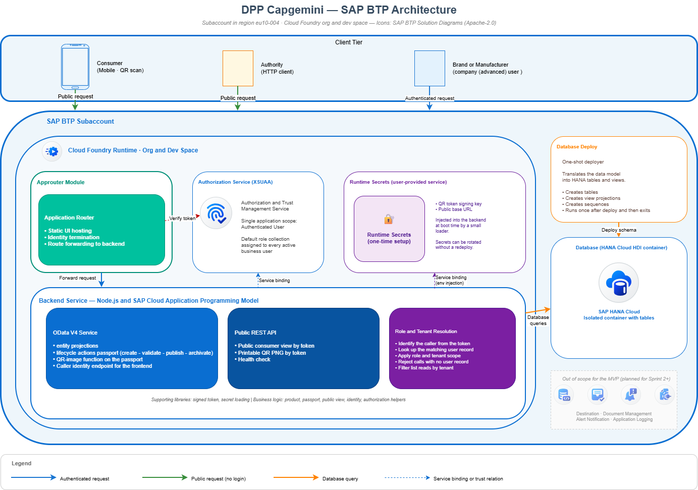
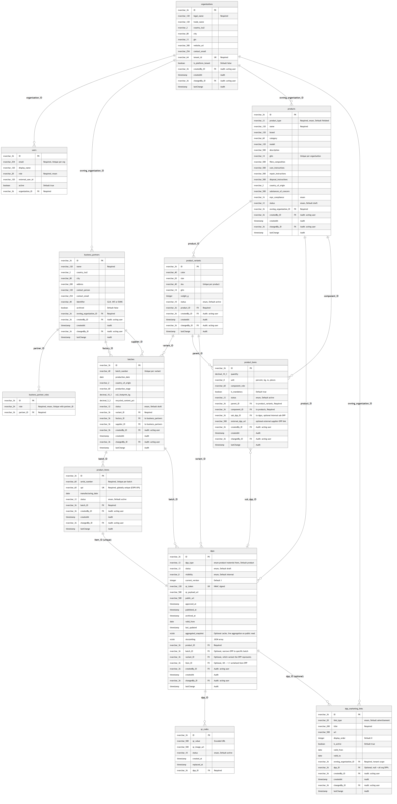

% DPP Capgemini — Technical Documentation
% Digital Product Passport Backend (Fashion)
% 2026

# Overview

The **dpp_capgemini** project is a backend for an EU-ESPR–oriented Digital Product Passport (DPP) targeted at the fashion industry. It is implemented as a TUM × Capgemini student project.

The schema is aligned with the **Fashion DPP Object Field Catalogue** (`Fashion_DPP_Object_Field_Catalogue.xlsm`), simplified to the MVP-relevant subset (12 entities). A DPP can be issued at three granularities: on a finished product, narrowed to a concrete production batch, or — at the finest level — on an individual serialised **Product Item** within a batch. Each Product Item carries exactly one unique DPP (with its own QR code), created automatically when the item is added. Bill-of-Materials links are anchored at the variant level and may attach an internal sub-DPP or an external supplier-DPP URL, forming a DPP hierarchy that is aggregated live on public read. The public DPP view can additionally show **marketing links** (ads / product info) — either per DPP or organisation-wide (e.g. a seasonal campaign). Sprint 2+ catalogue objects (Compliance Record, Sustainability Metric, Visibility Rule, Document Link, Certificate as N:N) are intentionally deferred.

**Technology stack**

- SAP Cloud Application Programming Model (CAP), Node.js, `@sap/cds` ^9
- CDS data model, OData V4 services, auto-generated OpenAPI / Swagger
- SQLite (development) / SAP HANA Cloud (production on SAP BTP)
- XSUAA authentication with two application roles (`company_advanced`, `company_user`). The platform issues a single scope; the backend resolves the role and tenant from the `Users` table.
- Public consumer endpoint (`/public/dpp/:token`, no login) with HMAC-signed QR-code PNG
- Jest unit tests + `cds.test` integration tests

This document follows the four required architecture deliverables:

1. **BTP Architecture** — where the application runs on the SAP Business Technology Platform
2. **Software Architecture** — internal structure, services, endpoints
3. **Semantic Model** — conceptual entity relationships
4. **Technical Data Model** — physical database schema as deployed

# 1. BTP Architecture

Deployment topology on SAP Business Technology Platform. The diagram embeds the official SAP BTP Solution Diagrams icons (Apache-2.0, <https://github.com/SAP/btp-solution-diagrams>).

## 1.1 Platform services in use

| Service | Role | Status |
|---|---|---|
| **SAP HANA Cloud** | Stores the 12 schema tables in an isolated database container | In use |
| **Cloud Foundry Runtime** | Hosts the backend service application | In use |
| **Authorization and Trust Management (XSUAA)** | Issues and verifies authentication tokens. Single application scope; role and tenant resolved inside the application from the user table. | In use |
| **Application Router** | Terminates the user session and serves the static UI | In use |
| **Runtime Secrets** (user-provided service) | Holds the signing key for QR tokens and the public base URL | One-time setup per space |
| Destination Service | Future ERP integration | Out of scope for the MVP |
| Document Management Service | Future compliance attachments | Sprint 2+ |
| Alert Notification | Future operations monitoring | Sprint 2+ |
| Application Logging | Future centralised logs | Sprint 2+ |

## 1.2 Subaccount coordinates

| Parameter | Description |
|---|---|
| Subaccount | Dedicated subaccount in region eu10-004 |
| Cloud Foundry Org | Provisioned by the platform team |
| Cloud Foundry Space | Dev (current) — staging and production planned |
| Public route | Application router URL on the SAP Cloud domain — the same URL is written into every QR code so consumer scans resolve correctly |

# 2. Software Architecture

Layers: client → BTP platform → API layer (authenticated OData and public REST) → business logic → supporting libraries → database. The platform also surfaces a Swagger UI and a health check endpoint.

## 2.1 Component overview

**Client layer**

- A SAPUI5 or Fiori Elements UI is planned for Sprint 2+; the current MVP exposes the backend directly via OData
- Consumers reach the system from a mobile browser via QR scan
- Market surveillance authorities use any HTTP client and the same public token URL as consumers

**BTP platform layer**

- Application Router handles single sign-on and serves the static UI
- Authorization and Trust Service (XSUAA) issues and verifies tokens
- Runtime Secrets are stored in a user-provided service and injected at boot

**API layer**

- Authenticated OData V4 service exposing 12 entity projections, 4 lifecycle actions and 1 QR-image function on the passport
- Public REST endpoints for the consumer view, the QR image and the health check
- A role and tenant resolver looks up the caller in the user table and applies tenant scope before any handler runs

**Business logic layer**

- Product logic — applies defaults, runs the bill-of-materials cycle check, archives products
- Product-item logic — on creation of a serialised item, resolves its product/variant/batch chain and auto-creates the unique item-level DPP plus an active QR code
- Marketing-link logic — tenant-defaults and validates marketing links; the public view surfaces active, in-window links (per DPP or organisation-wide), sorted by display order
- Passport lifecycle logic — approves, publishes, archives passports; rotates QR codes; builds aggregated snapshots
- Public view logic — verifies the signed QR token, traverses the DPP hierarchy and assembles the consumer payload including the live aggregation
- Identity logic — returns the caller's identity to the UI

**Supporting libraries**

- Signed token library (creates and verifies the QR token)
- Secret loader (injects runtime secrets into the backend)
- Aggregator library (`srv/lib/aggregator.js`) — recursive DPP-hierarchy aggregation with a plug-in registry of field aggregators (weighted sum, weighted average, string union, fibre rollup). New aggregators can be registered without touching existing logic.

**Database**

- SAP HANA Cloud, single isolated database container, 12 schema tables

## 2.2 Endpoint inventory

| Method | Path | Required role | Purpose |
|--------|------|---------------|---------|
| GET | `/odata/v4/dpp/$metadata` | any authenticated | Service metadata |
| GET / POST / PATCH / DELETE | `/odata/v4/dpp/<entity>` | role-restricted | CRUD on the 12 catalogue entities (tenant-scoped) |
| POST | `/odata/v4/dpp/DPPs(id)/DPPService.approveDPP` | company_advanced | draft → approved (with validation) |
| POST | `/odata/v4/dpp/DPPs(id)/DPPService.publishDPP` | company_advanced | approved → published + snapshot + QR rotation |
| POST | `/odata/v4/dpp/DPPs(id)/DPPService.archiveDPP` | company_advanced | → archived |
| POST | `/odata/v4/dpp/DPPs(id)/DPPService.regenerateQRToken` | company_advanced | new HMAC token, previous → replaced |
| GET | `/odata/v4/dpp/DPPs(id)/DPPService.generateQRCode` | company_advanced | Base64 PNG |
| GET | `/odata/v4/dpp/me()` | any authenticated | Caller's identity, role and organisation |
| GET | `/public/dpp/:token` | none | Consumer / authority DTO (JSON) |
| GET | `/public/dpp/:token/qr.png` | none | Printable QR PNG |
| GET | `/$api-docs/odata/v4/dpp` | none | Swagger UI |
| GET | `/healthz` | none | Liveness probe |

# 3. Semantic Model (Entity Relationship)

The semantic view of the data model — concepts and relationships, without implementation detail. Foreign-key columns, audit timestamps and operational marker fields are intentionally omitted (they are present in the Technical Data Model in section 4). The structural shape is identical to the technical view, but the attribute lists are reduced to those that carry business meaning.

Organizations sit at the top of the master-data tree; they own Users, Business Partners, and Products. A Product fans out through Product Variants → Batches → Product Items (individual serialised units). A Product Passport describes a finished product from the producer's view; it is anchored on a Product and may narrow to a concrete Batch, to the producing Variant, and — at the finest level — to a single Product Item. Each Product Item carries exactly one unique Passport (1:1). Each Passport keeps a history of QR Codes (latest = active). Bill-of-Materials lines hang from a Product Variant and reference a component Product. A BOM edge can attach either an internal sub-DPP (another Passport in the system) or an external supplier-DPP URL — this forms a DPP hierarchy that is traversed and aggregated live when a public consumer scans the QR code.

## 3.1 Business-relevant attributes per entity

- **Organisation** — Identifier, Legal name, Trade name, Country, Global Location Number, Tenant key.
- **User** — Identifier, Email, Display name, Role.
- **Business Partner** — Identifier, Name, Country, Contact person, External identifier (GLN / VAT / DUNS).
- **Business Partner Role** — Identifier, Role type.
- **Product** — Identifier, Product type (finished, material, component or packaging), Name, Brand, Category, Global Trade Item Number, Fibre composition, Country of origin, ESPR compliance state.
- **Product Variant** — Identifier, Colour, Size, Stock Keeping Unit, Weight.
- **Batch** — Identifier, Batch number, Production date, Country of origin, Production stage, CO2 footprint, Recycled content.
- **Product Item** — Identifier, Serial number, UPI (Unique Product Identifier, ESPR), Manufacturing date, Status. An individual serialised unit within a batch; carries exactly one unique Passport.
- **Product BOM** — Identifier, Quantity, Unit, Component role, Mandatory flag, Internal sub-passport link, External supplier-DPP URL.
- **Product Passport** — Identifier, Passport type (product / material / item), Status, Visibility, Signed token, Public link, Optional aggregation cache, Storytelling.
- **QR Code** — Identifier, Encoded value, Lifecycle status.
- **DPP Marketing Link** — Identifier, Link type, Title, URL, Display order, Active flag, Validity window. Shown on the public DPP view; either DPP-specific or organisation-wide.

The full column-level details with HANA data types and constraints are in section 4.

## 3.2 Cardinalities

| Relationship | Cardinality | Notes |
|---|---|---|
| Organisation → Users | one to many | tenant-scoped |
| Organisation → Products | one to many | tenant-scoped |
| Organisation → Business Partners | one to many | tenant-scoped |
| Business Partner → Business Partner Roles | one to many | a partner can hold several roles |
| Product → Product Variants | one to many | colour / size / SKU |
| Product Variant → Batches | one to many | production runs |
| Batch → Product Items | one to many | individual serialised units |
| Product Variant → Bill of Materials (as parent) | one to many | BOM anchored at variant |
| Bill of Materials → Product (as component) | many to one | component is itself a Product |
| Bill of Materials → Product Passport (internal sub-DPP) | many to optional one | optional, mutually informative with the external link |
| Product → Product Passport | one to many | DPP describes a finished-product view |
| Batch → Product Passport | one to many (optional) | optional narrowing to a concrete batch |
| Product Variant → Product Passport | one to many (optional) | optional link to the represented variant |
| Product Item → Product Passport | one to one | each item carries exactly one unique DPP |
| Product Passport → QR Codes | one active plus history | rotation keeps a single active row |
| Product Passport → Marketing Links | one to many (optional) | DPP-specific ads / product info |
| Organisation → Marketing Links | one to many | org-wide campaigns (DPP link null) |

# 4. Technical Data Model (Data Schema)

The physical schema as deployed to SAP HANA Cloud. The diagram below shows all 12 tables with their columns, HANA SQL data types, constraints, and foreign-key references.

The data model is declared in CDS (SAP Cloud Application Programming Model) and lives under `db/`. It is split into four files:

- `db/common.cds` — base types and enumerations
- `db/org.cds` — Company, Users, Business Partners
- `db/product.cds` — Products, Variants, Batches, Product Items, Bill of Materials
- `db/dpp.cds` — Digital Product Passport, QR Codes and Marketing Links

## 4.1 Types and Enumerations (`common.cds`)

| Type | Definition | Purpose |
|------|------------|---------|
| `CountryISO2` | `String(2)` | ISO-3166-1 alpha-2 country code |
| `GTIN` | `String(14)` | Global Trade Item Number |
| `GLN` | `String(13)` | Global Location Number |
| `EmailAddr` | `String(254)` | RFC 5321-compliant e-mail |
| `URL` | `String(500)` | External references, QR payload |
| `ProductType` | enum | finished, material, component, packaging |
| `ProductStatus` | enum | draft, approved, published, archived |
| `VariantStatus` | enum | active, inactive, archived |
| `BatchStatus` | enum | draft, approved, archived |
| `ProductItemStatus` | enum | active, sold, returned, recycled, archived |
| `BOMStatus` | enum | active, archived |
| `DPPStatus` | enum | draft, in_review, approved, published, archived |
| `DPPType` | enum | product, material, item |
| `Visibility` | enum | internal, public |
| `QRCodeStatus` | enum | active, invalid, replaced |
| `ESPRComplianceStatus` | enum | draft, in_review, compliant, non_compliant |
| `MarketingLinkType` | enum | advertisement, product_info, care_product, promotion, related_product, other |
| `UserRole` | enum | company_advanced, company_user |
| `BusinessPartnerRole` | enum | supplier, manufacturer, recycler, certification_body, distributor, retailer, logistics_provider |

The `identified` aspect provides a readable `String(36)` key instead of a UUID. This is a deliberate choice so that sample IDs such as `dpp-12345` and upstream system identifiers can be kept unchanged.

### The `audited` aspect (catalogue audit fields)

The catalogue business objects — Organizations, BusinessPartners, Products, ProductVariants, Batches, ProductItems, ProductBOMs and DPPs — plus the DPPMarketingLinks extension include a shared `audited` aspect (defined in `db/org.cds`) with the four catalogue audit fields:

| Field | Type | Column | Meaning |
|-------|------|--------|---------|
| createdBy | Association to Users | `createdBy_ID` | user who created the row |
| changedBy | Association to Users | `changedBy_ID` | user of the most recent change |
| createdAt | Timestamp | `createdAt` | creation time |
| lastChange | Timestamp | `lastChange` | time of the most recent change |

All four are stamped **server-side** by the central `before('CREATE')` / `before('UPDATE')` handlers in `srv/dpp-service.js`; client-supplied values are ignored. `createdBy` / `changedBy` reference the acting `Users` row (resolved from the authenticated identity). Per the catalogue, Users, BusinessPartnerRoles and QRCodes are **not** audited (QRCodes already carries its own `created_at`).

## 4.2 Company, User and Business Partner Entities (`org.cds`)

### Organizations (Company)

The tenant is represented by the `tenant_id` column (UNIQUE). Mapped to the catalogue's "Company" object.

| Field | Type | Constraint |
|-------|------|------------|
| ID | String(36) | Primary key |
| legal_name | String(120) | not null |
| trade_name | String(120) | |
| country_iso2 | CountryISO2 | |
| city | String(80) | |
| gln | GLN | |
| website_url | URL | |
| contact_email | EmailAddr | |
| tenant_id | String(64) | not null, UNIQUE |
| is_platform_tenant | Boolean | default false |

### Users

n:1 to Organizations; UNIQUE constraint on `(email, organization)`; `external_user_id` links to the XSUAA subject.

| Field | Type | Notes |
|-------|------|-------|
| ID | String(36) | Primary key |
| email | EmailAddr | not null |
| display_name | String(120) | |
| organization | Association to Organizations | not null |
| role | UserRole | not null |
| external_user_id | String(120) | XSUAA subject mapping |
| active | Boolean | default true |

### BusinessPartners

External economic operators (factories, suppliers, certification bodies). Tenant-scoped via `owning_organization`.

| Field | Type | Notes |
|-------|------|-------|
| ID | String(36) | Primary key |
| owning_organization | Association to Organizations | not null |
| name | String(120) | not null |
| country_iso2 | CountryISO2 | |
| city | String(80) | |
| address | String(200) | |
| contact_person | String(120) | |
| contact_email | EmailAddr | |
| identifier | String(40) | GLN / VAT / DUNS |
| archived | Boolean | default false |
| roles | Composition of BusinessPartnerRoles | a partner can hold multiple roles |

### BusinessPartnerRoles

Bridge table — one partner may simultaneously act as supplier, manufacturer, recycler, etc.

| Field | Type | Notes |
|-------|------|-------|
| ID | String(36) | Primary key |
| partner | Association to BusinessPartners | not null |
| role | BusinessPartnerRole | not null |

UNIQUE on `(partner, role)`.

## 4.3 Product Hierarchy (`product.cds`)

The hierarchy is **Product → ProductVariant → Batch → ProductItem → DPP + QR**. Bill-of-Materials lines hang from a `ProductVariants` row and reference a component `Products` row. A BOM edge can attach either an internal `DPPs` row (`sub_dpp`) or an external supplier-DPP URL (`external_dpp_url`); the consumer-facing read traverses this graph recursively and aggregates values across levels.

### Products

Generic product master data: a finished product, material, component or packaging. Tenant-scoped via `owning_organization`.

| Field | Type | Notes |
|-------|------|-------|
| ID | String(36) | Primary key |
| owning_organization | Association to Organizations | not null |
| product_type | ProductType | not null, default `finished` |
| name | String(120) | not null |
| brand | String(120) | |
| category | String(60) | |
| model | String(120) | |
| description | String(500) | |
| gtin | GTIN | UNIQUE per organization |
| fibre_composition | String(500) | catalogue Sheet 3 R32 |
| care_instructions | String(500) | |
| repair_instructions | String(500) | |
| disposal_instructions | String(500) | |
| country_of_origin | CountryISO2 | high-level origin |
| substances_of_concern | String(500) | REACH / SCIP text (Sheet 3 R37) |
| espr_compliance | ESPRComplianceStatus | default `draft` |
| status | ProductStatus | default `draft` |

### ProductVariants

n:1 to Products. A variant captures color/size/SKU and identification at variant level. The Bill of Materials is anchored here (`bom` Composition).

| Field | Type | Notes |
|-------|------|-------|
| ID | String(36) | Primary key |
| product | Association to Products | not null |
| color | String(40) | |
| size | String(20) | |
| sku | String(40) | UNIQUE per product |
| gtin | GTIN | |
| weight_g | Integer | |
| status | VariantStatus | default `active` |
| bom | Composition of many ProductBOMs | child BOM edges |

### Batches

n:1 to ProductVariants. Captures production-time information (factory, country, CO₂).

| Field | Type | Notes |
|-------|------|-------|
| ID | String(36) | Primary key |
| variant | Association to ProductVariants | not null |
| batch_number | String(40) | UNIQUE per variant |
| production_date | Date | |
| factory | Association to BusinessPartners | optional |
| supplier | Association to BusinessPartners | optional |
| country_of_origin | CountryISO2 | |
| production_stage | String(60) | |
| co2_footprint_kg | Decimal(10,3) | |
| recycled_content_pct | Decimal(5,2) | |
| status | BatchStatus | default `draft` |
| items | Association to many ProductItems | serialised units produced in the batch |

### ProductItems

n:1 to Batches. An individual serialised unit produced within a batch — the finest level of the product hierarchy. Each item carries exactly one unique DPP, created automatically on insert (see [`srv/handlers/product-item-handlers.js`](../srv/handlers/product-item-handlers.js)).

| Field | Type | Notes |
|-------|------|-------|
| ID | String(36) | Primary key |
| batch | Association to Batches | not null |
| serial_number | String(60) | not null — manufacturer serial, UNIQUE per batch |
| upi | String(60) | not null, globally UNIQUE — Unique Product Identifier (ESPR); the identifier the DPP/QR resolves to |
| manufacturing_date | Date | |
| status | ProductItemStatus | default `active` |
| dpp | Association to DPPs | 1:1 reverse navigation (`dpp.item = $self`) |

The **UPI** (Unique Product Identifier) is the ESPR-defined, globally unique product key carried by the data carrier (QR). A caller may supply a standardised UPI (e.g. GS1 / GTIN + serial); if omitted, the handler mints a unique one (`UPI-<uuid>`). It is distinct from `serial_number`, which is the manufacturer's internal serial (unique only within its batch).

On `CREATE`, the handler resolves the batch → variant → product chain and inserts a matching `DPPs` row (`dpp_type='item'`, `status='draft'`) with a freshly minted `qr_token` and an active `QRCodes` row, so every serialised item immediately has a unique, scannable passport.

### ProductBOMs

Bill of Materials: an edge between a parent ProductVariant and a component Product. The component is itself a `Products` row, so the chain repeats recursively (its own variants, batches and DPPs). A BOM line may attach an internal sub-DPP and/or an external supplier-DPP URL — the consumer-side read traverses these links to build a hierarchical aggregation.

| Field | Type | Notes |
|-------|------|-------|
| ID | String(36) | Primary key |
| parent | Association to ProductVariants | not null — finished-product variant |
| component | Association to Products | not null — material/component product |
| quantity | Decimal(10,3) | |
| unit | String(8) | `%`, `kg`, `m`, `pcs` |
| component_role | String(60) | e.g. "Main fabric" |
| is_mandatory | Boolean | default true |
| sub_dpp | Association to DPPs | optional internal sub-DPP |
| external_dpp_url | URL | optional external supplier-DPP link |
| status | BOMStatus | default `active` |

UNIQUE on `(parent, component)`. A self-loop (`parent.product = component`) and transitive cycles are rejected by handler. The cycle check walks BOM edges by expanding each Product into its Variants and then into their outgoing BOM rows.

## 4.4 Digital Product Passport (`dpp.cds`)

### DPPs

The central passport entity. A DPP represents a finished product from the perspective of its producer. The optional `batch`, `variant` and `item` links progressively narrow the passport: `batch` to a concrete production run, `variant` to the represented variant, and `item` to a single serialised unit. An item-level DPP (`dpp_type='item'`) is linked 1:1 to its `ProductItems` row. Without these links the passport applies on a model/product level.

| Field | Type | Meaning |
|-------|------|---------|
| ID | String(36) | Primary key |
| product | Association to Products | not null — describes which product the DPP belongs to |
| batch | Association to Batches | optional — narrows the DPP to a specific batch |
| variant | Association to ProductVariants | optional — which variant the DPP represents |
| item | Association to ProductItems | optional, UNIQUE — 1:1 link for serialised item-level DPPs |
| dpp_type | DPPType | default `product` (`product` / `material` / `item`) |
| status | DPPStatus | default `draft` |
| visibility | Visibility | default `internal` |
| current_version | Integer | default 1, incremented on re-publish |
| qr_token | String(128) | UNIQUE, HMAC-signed |
| qr_payload_url | URL | encoded into the QR PNG |
| public_url | URL | stable direct link to the DPP page |
| approved_at, published_at, archived_at | Timestamp | lifecycle markers |
| valid_from | Date | |
| last_updated | Timestamp | |
| aggregated_snapshot | LargeString | optional cache of the last aggregation; the public read computes aggregations live |
| storytelling | LargeString | optional JSON array of `{title, body, media_url, media_type}` |

The hierarchical aggregation is computed on-demand by [`srv/lib/aggregator.js`](../srv/lib/aggregator.js). For every public read it walks the BOM graph downwards from the DPP's variant, recurses into every `sub_dpp`, and combines self values with weighted child contributions. Out-of-the-box aggregators: `co2_footprint_kg` (weighted sum), `recycled_content_pct` (weighted average), `substances_of_concern` (union), `fibre_composition` (rollup). Additional aggregators can be registered at runtime through `registerAggregator(name, def)`. Sub-DPPs that are external (URL only) or missing are reported as `missing` entries with `incomplete: true` on the response.

### QRCodes

History of every QR token ever minted for a DPP. The most recent row has `status='active'`; previous rows are kept with `status='replaced'` for traceability.

| Field | Type | Notes |
|-------|------|-------|
| ID | String(36) | Primary key |
| dpp | Association to DPPs | not null |
| qr_value | URL | encoded URL on the physical label |
| qr_image_url | URL | optional pointer to a rendered PNG |
| status | QRCodeStatus | `active`, `invalid`, `replaced` |
| created_at | Timestamp | |
| replaced_at | Timestamp | |

### DPPMarketingLinks

Marketing / advertising links shown on the **public DPP view** (ads, product info, care products, promotions). A link is either attached to a specific `dpp` (e.g. an item-level care-product ad) or **organisation-wide** when `dpp` is null (e.g. a "Summer sale" campaign shown across all the organisation's published DPPs). Tenant-scoped via `owning_organization`; includes the `audited` aspect.

| Field | Type | Notes |
|-------|------|-------|
| ID | String(36) | Primary key |
| owning_organization | Association to Organizations | not null — tenant scope |
| dpp | Association to DPPs | optional — null = applies to all of the org's DPPs |
| link_type | MarketingLinkType | default `advertisement` |
| title | String(200) | not null |
| url | URL | target link |
| display_order | Integer | default 0 — ascending sort in the view |
| is_active | Boolean | default true |
| valid_from | Date | optional start of the display window |
| valid_to | Date | optional end of the display window |

The public consumer read ([`srv/handlers/public-handler.js`](../srv/handlers/public-handler.js)) returns, for a published/public DPP, all `is_active` links of the DPP's organisation whose validity window covers the current date and that either target this DPP or are org-wide (`dpp` null), sorted by `display_order`.

## 4.5 Uniqueness and Integrity Constraints

- `Organizations.tenant_id` UNIQUE
- `Users (email, organization)` UNIQUE
- `BusinessPartnerRoles (partner, role)` UNIQUE
- `Products (gtin, owning_organization)` UNIQUE
- `ProductVariants (sku, product)` UNIQUE
- `Batches (batch_number, variant)` UNIQUE
- `ProductItems (serial_number, batch)` UNIQUE — no duplicate serials within a batch
- `ProductItems.upi` UNIQUE — globally unique product identifier (ESPR)
- `ProductBOMs (parent, component)` UNIQUE — no duplicate BOM edges, no self-loops, no cycles (parent is a Variant)
- `DPPs.qr_token` UNIQUE
- `DPPs.item` UNIQUE — exactly one DPP per serialised item (1:1)

## 4.6 CDS → HANA → ABAP type mapping

| Modelling type | HANA SQL | ABAP equivalent | Notes |
|---|---|---|---|
| `String(n)` | `NVARCHAR(n)` | `CHAR(n)` or `SSTRING` | UTF-16 in HANA |
| `LargeString` | `NCLOB` | `STRING` | Up to 2 GB |
| `Boolean` | `BOOLEAN` | `BOOLE_D` or `ABAP_BOOL` | |
| `Integer` | `INTEGER` | `INT4` | 32-bit signed |
| `Integer64` | `BIGINT` | `INT8` | 64-bit signed |
| `Decimal(p,s)` | `DECIMAL(p,s)` | `DEC(p,s)` | |
| `Date` | `DATE` | `DATS` | YYYYMMDD |
| `Time` | `TIME` | `TIMS` | HHMMSS |
| `Timestamp` | `TIMESTAMP` | `TIMESTAMPL` | 100 ns precision |
| `UUID` | `NVARCHAR(36)` | `SYSUUID_C32` or `SYSUUID_X16` | |
